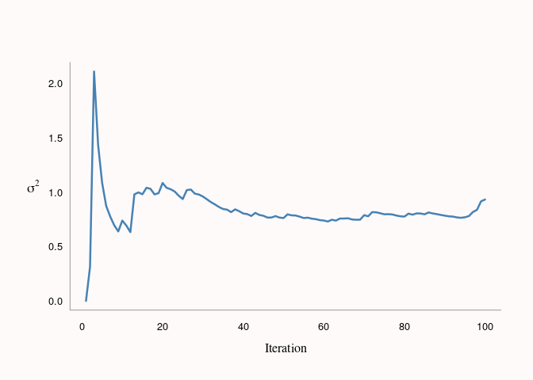
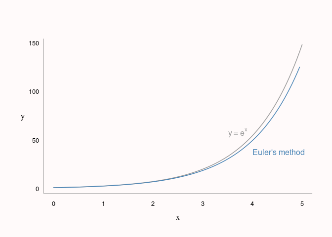
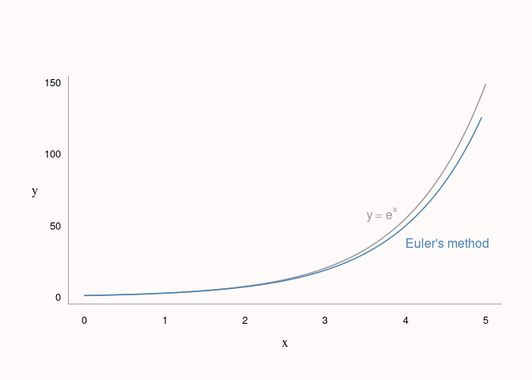
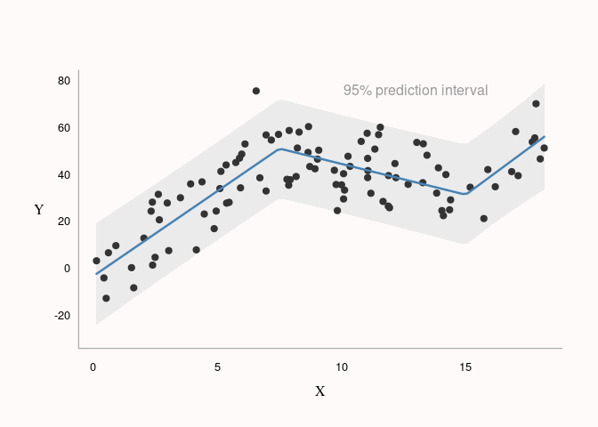
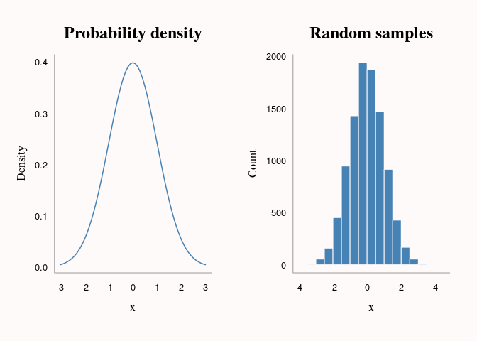

Handy Algorithms
================
Adam Bartonicek
(last updated: 2021-05-06)

-   [Handy Algorithms](#handy-algorithms)
    -   [Cumulative mean and cumulative variance via updating (Welford’s
        Algorithm)](#cumulative-mean-and-cumulative-variance-via-updating-welfords-algorithm)
    -   [Euler’s method](#eulers-method)
    -   [Determinant via
        row-operations](#determinant-via-row-operations)
    -   [Inverse transform random
        sampling](#inverse-transform-random-sampling)
    -   [Piecewise linear regression](#piecewise-linear-regression)
    -   [Pseudo-random number generation (linear congruential
        generator)](#pseudo-random-number-generation-linear-congruential-generator)

# Handy Algorithms

This is a kind of personal handbook of short algorithms, methods and
tricks that I found useful at some time or another during my journey
into statistical computing. I’m writing this to help me remember:

1.  What interesting statistical computing problems I have encountered
    in the past
2.  How to solve them (in a clever/interesting way)

Each piece of code may not be the most efficient/elegant solutions to a
given problem. Instead, I tried to strike balance between legibility and
length.

Most of the code will be in R, unless I decide otherwise.

## Cumulative mean and cumulative variance via updating (Welford’s Algorithm)

Find cumulative variance for a sample with 1 additional new observation.
This is an efficient solution when we know the mean and variance of a
vector *x* and a new value *x*<sub>*n**e**w*</sub>, but don’t want to
recompute mean and variance across the whole vector (for example, when
the vector is big or when we need to repeat the process many times).

The formula for the new mean is a simple weighted average of the old
mean and the new observation. The formula for the new variance is more
complicated and is not numerically stable (the difference between old
and new variance is extremely small for large enough *n*), so it is
easier to compute cumulative sum of squares and then divide by *n* − 1
to get the variance.

(from [Wikipedia article on Algorithms for calculating
variance](https://en.wikipedia.org/wiki/Algorithms_for_calculating_variance))

``` r
x <- rnorm(100)
n <- seq_along(x)

cmu <- numeric(100)
cmu[1] <- x[1]
csumsq <- numeric(100)

# Compute cumulative variance (+ mean) via updating
for (i in 2:100) {
  cmu[i] <- (n[i - 1] * cmu[i - 1] + x[i]) / n[i] # Cumulative mean
  csumsq[i] <- csumsq[i - 1] +                    # Cumulative sum of squares
    (x[i] - cmu[i - 1]) * (x[i] - cmu[i])
}

csigma1 <- csumsq / (n - 1)
csigma1[1] <- 0

# Compute cumulative variance the effortful way
csigma2 <- numeric(100)
for (i in 2:100) {
  csigma2[i] <- var(x[1:i])
}

all.equal(csigma1, csigma2)
```

    ## [1] TRUE



## Euler’s method

Find an approximate numerical solution to an ordinary differential
equation. Useful for when we want to find an approximation to function
*y* but only know its derivative, *dy*, and it’s value *y*<sub>0</sub>
at some initial *x*<sub>0</sub>.

We start from the initial value, and then iteratively increment *x* by a
stepsize and *y* by the derivative (evaluated at previous *x*) times the
stepsize:

``` r
# Derivative of function y
dy <- function(y) y

# Inputs: derivative function, initial x, initial y, stepsize, length
euler <- function(dy = NULL, x0 = 0, y0 = 1, stepsize = 0.1, len = 100) {
  
  x <- numeric(len)
  y <- numeric(len)
  
  x[1] <- x0
  y[1] <- y0
  
  # Iterate: 1) increment x by stepsize
  #          2) increment y by stepsize times derivative
  for (i in 2:len) {
    x[i] <- x[i - 1] + stepsize
    y[i] <- y[i - 1] + stepsize * dy(y[i - 1])
  }

  # Return list of x's and y's
  list(x = x, y = y)
}

# Example
b <- euler(dy, stepsize = 0.05)
x <- seq(0, 5, length.out = 100)

# Plot code not shown (see .Rmd)
```



## Determinant via row-operations

Find the determinant of a square matrix using row-operations.
Alternative to finding the determinant through minors and co-factors.
Based on the following properties of determinants:

1.  Multiplying row *i* by *c* mutliplies the determinant by *c*
2.  Subtracting *c* times row *i* from row *j* does not affect the
    determinant

We start from the first row of the matrix and then do row operations to
get 1’s on the diagonal and 0’s under the diagonal, keeping score of the
factors by which we multiply/divide the rows, and then multiply out the
factors together:

``` r
det_row <- function(mat) {
  
  nr <- nrow(mat)
  fact <- numeric(nr - 1)
  
  for (i in seq_len(nr - 1)) {
    # Normalize current row (1 in first column) & save the multiplication factor
    fact[i] <- mat[i, i]
    mat[i, ] <- mat[i, ] / mat[i, i]
    
    # Subtract multiples of current row from rows below (get all 0's)
    for (j in (i + 1):nr)
      mat[j, ] <- mat[j, ] - mat[j, i] * mat[i, ] 
  }
  # Take the product of mult. factors & the last (unscaled) value in the matrix 
  prod(fact) * mat[nr, nr]
}

# Example

set.seed(12345)
mat <- matrix(sample(1:9), ncol = 3)

c(det_row(mat), det(mat))
```

    ## [1] -95 -95

## Inverse transform random sampling

Generate random samples for an arbitrary distribution by using inverse
cumulative density function (or numerical approximation of it). This is
useful when we have a probability density function (PDF) but no function
to draw samples from it (e.g. like `rnorm()`, `rpois()`, etc…). If we
have cumulative density function (CDF), we can use it directly,
otherwise we can also make a CDF via R’s numerical integration.

(from Ben Lambert’s [Student Guide to Bayesian Statistics problem
sets](https://study.sagepub.com/lambert))

We take a CDF, approximate the inverse CDF (ICDF) via R’s `approxfun()`,
and then use this to back-transform `runif()` samples (cumulative
probabilities) into samples from our PDF:

``` r
# Probability density function (normal)
pdf <- function(x) (1 / sqrt(2 * pi)) * exp(-1/2 * (x)^2)

# ...suppose we didn't have rnorm() but had the pdf() above

# Use R's numerical integration to make a CDF
cdf <- function(x) {
  integrate(pdf, 0, x)[[1]]
}

# Make inverse CDF by numeric approximation (linear)
cumdens <- sapply(seq(0.01, 5, 0.01), cdf)
icdf <- approxfun(cumdens, seq(0.01, 5, 0.01))

# Draw random samples & transform via ICDF (+ flip sign)
samples <- runif(10000, 0, 0.5)
x <- icdf(samples) * ifelse(runif(1000, 0, 2) > 1, 1, -1)

# Plot code not shown (see .Rmd)
```



## Piecewise linear regression

Fit a linear regression model (in base R) with pre-specified
break-points (knots) in the trend. A quick and dirty way to fit fairly
non-linear data without having to use splines, polynomials, etc…

(from the amazing [STATS782 Statistical
Computing](https://study.sagepub.com/lambert) course at UoA)

``` r
n <- 100
x <- round(runif(n, 0, 19), 2)

tau <- c(7.5, 15) # Knots
X <- cbind(x, pmax(outer(x, tau, '-'), 0)) # If x > knot, diff from knot, else 0
betas <- c(5, -10, 10) # Coefficients

y <- 0 + 2 * x + X %*% betas + rnorm(n, 0, 10)

fit1 <- lm(y ~ ., data = data.frame(X))
coef1 <- coef(fit1)

newx <- seq(min(x), max(x), length.out = 100)
newX <- cbind(newx, pmax(outer(newx, tau, '-'), 0))
colnames(newX) <- c('x', 'V2', 'V3')

#newy <- coef1[1] + newX %*% coef1[-1]
newy <- predict(fit1, data.frame(newX), type = 'response',
                interval = 'prediction')
```



## Pseudo-random number generation (linear congruential generator)

Generate “random” samples using the following function:

*s*<sub>*t*</sub> = (*a* ⋅ *s*<sub>*t* − 1</sub> + *b*) mod *M*

where *a*, *b*, and *M* are integers and *s*<sub>*t*</sub> is the
current sample.

(from Ben Lambert’s [Student Guide to Bayesian Statistics problem
sets](https://study.sagepub.com/lambert))

``` r
s0 <- 1
a <- 1597
b <- 51749
M <- 244944

nsamples <- 300

s <- numeric(nsamples)
s[1] <- s0

for (i in 2:nsamples) {
  s[i] = (a * s[i - 1] + b) %% M
}

s <- s / max(s)

# Plot code not shown (see .Rmd)
```


