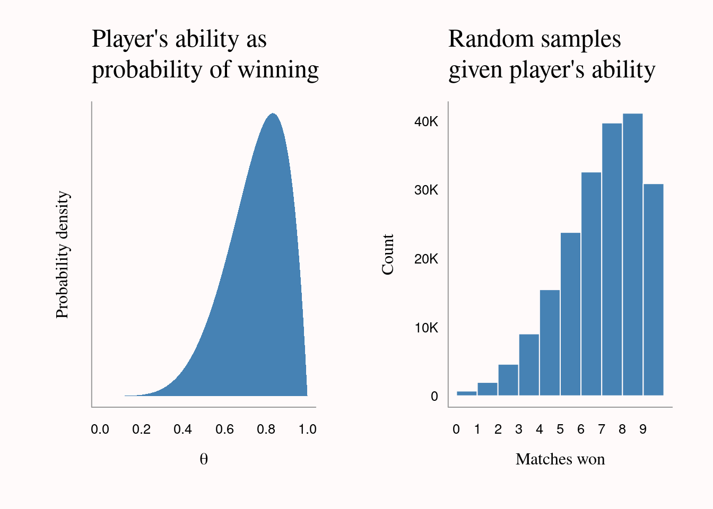
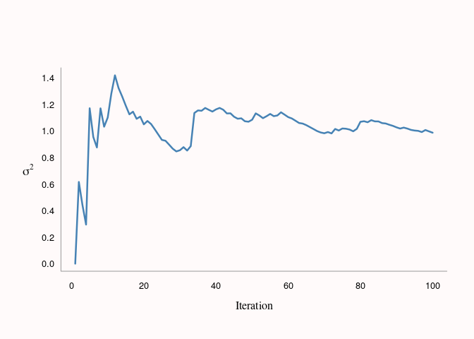
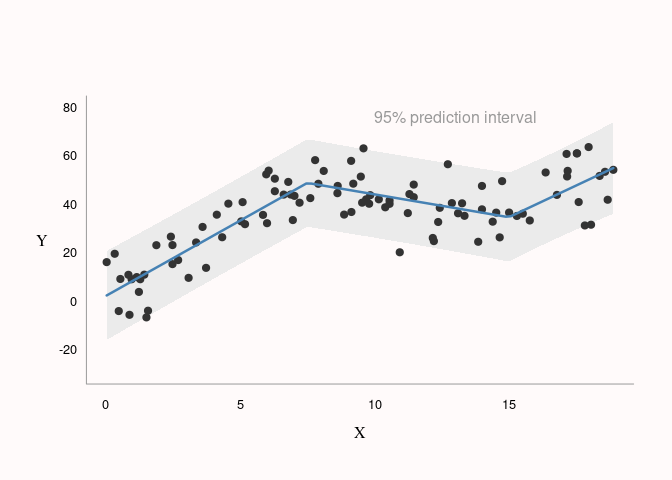

Bag of Tricks
================
Adam Bartonicek
(last updated: 2021-06-10)

-   [Bayes Rule](#bayes-rule)
-   [Cumulative mean and cumulative variance via updating (Welford’s
    Algorithm)](#cumulative-mean-and-cumulative-variance-via-updating-welfords-algorithm)
-   [Euler’s method](#eulers-method)
-   [Determinant via row-operations](#determinant-via-row-operations)
-   [Faster `sample()`](#faster-sample)
-   [Generalized cross-validation
    (GCV)](#generalized-cross-validation-gcv)
-   [Inverse transform random
    sampling](#inverse-transform-random-sampling)
-   [Linear regression via chunks](#linear-regression-via-chunks)
-   [Piecewise linear regression](#piecewise-linear-regression)
-   [Pseudo-random number generation (linear congruential
    generator)](#pseudo-random-number-generation-linear-congruential-generator)
-   [Variance-covariance matrix by
    hand](#variance-covariance-matrix-by-hand)

This is a kind of personal handbook of short algorithms, methods, and
tricks that I found useful at some time or another during my journey
into statistical computing. I’m compiling this list to help me remember:

1.  What interesting statistical computing problems I have encountered
    in the past
2.  How to solve them

Each piece of code is probably not the most efficient/elegant solution
to a given problem. Instead, I tried to strike balance between length
and legibility.

Most of the code will be in R, unless I decide otherwise. Code for the
plots is not shown but can be found in the .Rmd file.

If you find any problems or inconsistencies, please email me at:
<bartonicek@gmail.com>

## Bayes Rule

Given a set of possible actions, find the optimal action by weighing a
loss function by the posterior probability/predictive distribution.

**Example:** let’s say I observe a tennis player play against 5 oponents
and win in for of the five matches: *y* = 1, 1, 1, 0, 1. Another person
at the tennis match offers me the following bet:

> The tennis player is going to play 10 more matches. For $30, I can bet
> how many tennis matches the player wins. If he wins at least the X
> matches I bet on, then the person will pay me $10 for every match won.
> If the tennis player wins fewer than X matches, I get nothing and he
> keeps my $30.

To find out how many matches I should bet on, I can do the following
Bayesian analysis:

``` r
y <- c(1, 1, 1, 1, 0, 1)
theta <- seq(0, 1, 0.01)

# Non-informative Beta(1, 1) prior + observed y and (n-y)
a <- 1 + sum(y)
b <- 1 + length(y) - sum(y)

# Calculate and normalize posterior
post <- dbeta(theta, a, b)
post <- post / sum(post)

# Draw random 1,000,000 samples:
n <- 1e6
theta_s <- rbeta(n, a, b) # ...of theta
y_s <- rbinom(n, 10, theta_s) # ...of wins out of 10 matches
```



 

``` r
# Probs. of matches won
ps <- table(y_s) / sum(table(y_s))

# Cumulative probs. of winning at least X matches
cps <- cumsum(rev(ps)) # Have to reverse to count X or fewer

# Expected outcomes for each decision
tab <- cbind(Wins = 10:0,
      `Probability of X wins` = round(as.numeric(rev(ps)), 3), 
      `Probability of X or more wins` = round(as.numeric(cps), 3),
      Payoff = round(cps * (10:0) * 10 - 30, 2))

knitr::kable(tab, row.names = FALSE)
```

| Wins | Probability of X wins | Probability of X or more wins | Payoff |
|-----:|----------------------:|------------------------------:|-------:|
|   10 |                 0.154 |                         0.154 | -14.56 |
|    9 |                 0.206 |                         0.360 |   2.44 |
|    8 |                 0.199 |                         0.559 |  14.74 |
|    7 |                 0.163 |                         0.722 |  20.54 |
|    6 |                 0.119 |                         0.841 |  20.46 |
|    5 |                 0.078 |                         0.918 |  15.92 |
|    4 |                 0.045 |                         0.964 |   8.55 |
|    3 |                 0.023 |                         0.987 |  -0.40 |
|    2 |                 0.010 |                         0.996 | -10.07 |
|    1 |                 0.003 |                         0.999 | -20.01 |
|    0 |                 0.001 |                         1.000 | -30.00 |

Clearly, the best choice is to bet that the tennis player is going to
win 7 matches, as it has the highest expected outcome of $20.56 (or, if
I feel a bit more conservative, I can bet 6 matches which have almost
the same expected outcome with $20.44).

## Cumulative mean and cumulative variance via updating (Welford’s Algorithm)

Find cumulative variance for a sample with 1 additional new observation.
This is an efficient solution when we know the mean and variance of a
vector *x* and a new value *x*<sub>*n**e**w*</sub>, but don’t want to
recompute mean and variance across the whole vector (for example, when
the vector is big or when we need to repeat the process many times).

The formula for the new mean is a simple weighted average of the old
mean and the new observation. The formula for the new variance is more
complicated and not very numerically stable (the difference between old
and new variance will be very small after enough iterations). As such,
it is easier to compute the (numerically stable) cumulative sum of
squares and then divide by *n* − 1 to get the variance.

(from [Wikipedia article on Algorithms for calculating
variance](https://en.wikipedia.org/wiki/Algorithms_for_calculating_variance))

``` r
set.seed(123456)
x <- rnorm(100)
n <- seq_along(x)

cmu <- numeric(100)
cmu[1] <- x[1]
csumsq <- numeric(100)

# Compute cumulative variance (+ mean) via updating
for (i in 2:100) {
  cmu[i] <- (n[i - 1] * cmu[i - 1] + x[i]) / n[i] # Cumulative mean
  csumsq[i] <- csumsq[i - 1] +                    # Cumulative sum of squares
    (x[i] - cmu[i - 1]) * (x[i] - cmu[i])
}

csigma1 <- csumsq / (n - 1)
csigma1[1] <- 0

# Compute cumulative variance the effortful way
csigma2 <- numeric(100)
for (i in 2:100) {
  csigma2[i] <- var(x[1:i])
}

all.equal(csigma1, csigma2)
```

    ## [1] TRUE



## Euler’s method

Find an approximate numerical solution to an ordinary differential
equation. Useful for when we want to find an approximation to function
*y* but only know its derivative, *dy*, and it’s value *y*<sub>0</sub>
at some initial *x*<sub>0</sub>.

We start from the initial value, and then iteratively increment *x* by a
stepsize and *y* by the derivative (evaluated at previous *x*) times the
stepsize:

``` r
# Derivative of function y
dy <- function(y) y

# Inputs: derivative function, initial x, initial y, stepsize, length
euler <- function(dy = NULL, x0 = 0, y0 = 1, stepsize = 0.1, len = 100) {
  
  x <- numeric(len)
  y <- numeric(len)
  
  x[1] <- x0
  y[1] <- y0
  
  # Iterate: 1) increment x by stepsize
  #          2) increment y by stepsize times derivative
  for (i in 2:len) {
    x[i] <- x[i - 1] + stepsize
    y[i] <- y[i - 1] + stepsize * dy(y[i - 1])
  }

  # Return list of x's and y's
  list(x = x, y = y)
}

# Example
b <- euler(dy, stepsize = 0.05)
x <- seq(0, 5, length.out = 100)
```


## Determinant via row-operations

Find the determinant of a square matrix using row-operations.
Alternative to finding the determinant through minors and co-factors.
Based on the following properties of determinants:

1.  Multiplying row *i* by *c* mutliplies the determinant by *c*
2.  Subtracting *c* times row *i* from row *j* does not affect the
    determinant

We start from the first row of the matrix and then do row operations to
get 1’s on the diagonal and 0’s under the diagonal, keeping score of the
factors by which we multiply/divide the rows, and then multiply out the
factors together:

``` r
det_row <- function(mat) {
  
  nr <- nrow(mat)
  fact <- numeric(nr - 1)
  
  for (i in seq_len(nr - 1)) {
    # Normalize current row (1 in first column) & save the multiplication factor
    fact[i] <- mat[i, i]
    mat[i, ] <- mat[i, ] / mat[i, i]
    
    # Subtract multiples of current row from rows below (get all 0's)
    for (j in (i + 1):nr)
      mat[j, ] <- mat[j, ] - mat[j, i] * mat[i, ] 
  }
  # Take the product of mult. factors & the last (unscaled) value in the matrix 
  prod(fact) * mat[nr, nr]
}

# Example

set.seed(123456)
mat <- matrix(sample(1:9), ncol = 3)

c(det_row(mat), det(mat))
```

    ## [1] 91 91

## Faster `sample()`

Generate a vector of random numbers (possibly integers) using `runif()`.
Faster than using `sample()`. Useful for e.g. simulation or generating
cross-validation indices.

(from the great [STATS782 Statistical
Computing](https://study.sagepub.com/lambert) course at UoA)

``` r
set.seed(123456)
# Same result as sample(1:9, 100, replace = TRUE)
ceiling(runif(20, 0, 9))
```

    ##  [1] 8 7 4 4 4 2 5 1 9 2 8 6 9 8 9 9 8 2 4 7

``` r
n <- 1e7
t1 <- system.time(ceiling(runif(n, 0, 9))) # Almost 2 x faster
t2 <- system.time(sample(1:9, n, replace = TRUE))

knitr::kable(rbind(t1, t2)[, 1:3])
```

|     | user.self | sys.self | elapsed |
|:----|----------:|---------:|--------:|
| t1  |     0.328 |    0.012 |   0.340 |
| t2  |     0.616 |    0.020 |   0.636 |

## Generalized cross-validation (GCV)

Compute an efficient approximation to leave-one-out cross-validation
(LOO-CV) using hat-values (leverages) from a fitted model. Requires the
model to be fit only once (instead of *n* times).

From [An Introduction to Statistical
Learning](https://www.statlearning.com/)

``` r
fit <- lm(mpg ~ wt, data = mtcars) # Good old boring mtcars data

y <- mtcars$mpg
preds <- fitted(fit) # Predicted values
h <- hatvalues(fit) # Leverages

# Almost MSE but each diff divided by (1 - h) before squaring
mse_gcv <- sum(((y - preds) / (1 - h))^2) / length(y) 

se_cv <- numeric(length(y))

for (i in seq_along(y)) {
  fit <- lm(mpg ~ wt, data = mtcars[-i, ])
  se_cv[i] <- (y[i] - predict(fit, newdata = mtcars[i, ]))^2
}

mse_cv <- mean(se_cv)

c(GCV = mse_gcv, `LOO-CV` = mse_cv) # identical
```

    ##      GCV   LOO-CV 
    ## 10.25071 10.25071

## Inverse transform random sampling

Generate random samples for an arbitrary distribution by using inverse
cumulative density function (or numerical approximation of it). This is
useful when we have a probability density function (PDF) but no function
to draw samples from it (e.g. like `rnorm()`, `rpois()`, etc…). If we
have cumulative density function (CDF), we can use it directly,
otherwise we can also make a CDF via R’s numerical integration.

(from Ben Lambert’s [Student Guide to Bayesian Statistics problem
sets](https://study.sagepub.com/lambert))

We take a CDF, approximate the inverse CDF (ICDF) via R’s `approxfun()`,
and then use this to back-transform `runif()` samples (cumulative
probabilities) into samples from our PDF:

``` r
# Probability density function (normal)
pdf <- function(x) (1 / sqrt(2 * pi)) * exp(-1/2 * (x)^2)

# ...suppose we didn't have rnorm() but had the pdf() above

# Use R's numerical integration to make a CDF
cdf <- function(x) {
  integrate(pdf, 0, x)[[1]]
}

# Make inverse CDF by numeric approximation (linear)
cumdens <- sapply(seq(0.01, 5, 0.01), cdf)
icdf <- approxfun(cumdens, seq(0.01, 5, 0.01))

# Draw random samples & transform via ICDF (+ flip sign)
samples <- runif(10000, 0, 0.5)
x <- icdf(samples) * ifelse(runif(1000, 0, 2) > 1, 1, -1)
```


## Linear regression via chunks

Fit a linear regression by calculating *X*<sup>*T*</sup>*X* and
*X*<sup>*T*</sup>*y* only with chunk of the data at a time, accumulating
the results. Useful when the data too large to keep in memory -
streaming.

``` r
X <- matrix(c(rep(1, 100),                       # Predictor matrix
              floor(runif(100, 0, 10)),
              floor(runif(100, 0, 10))), ncol = 3)
beta <- c(-0.5, 2.25, -1)                        # Predictor slopes
y <- X %*% beta + rnorm(100, 0, 1)               

XtX <- matrix(0, 3, 3)                           # Initialize empty
XtY <- matrix(0, 3, 1)                           # XtX and XtY matrices

for (i in 0:9) {
  m1 <- t(X[i * 10 + 1:10, ]) %*% X[i * 10 + 1:10, ] # Compute XtX and XtY
  m2 <- t(X[i * 10 + 1:10, ]) %*% y[i * 10 + 1:10, ] # on chunks of data
 
  XtX <- XtX + m1      # Accumulate results
  XtY <- XtY + m2
}

solve(XtX) %*% XtY                  # Using the chunking method
```

    ##            [,1]
    ## [1,] -0.5691946
    ## [2,]  2.2319190
    ## [3,] -0.9955033

``` r
solve(t(X) %*% X) %*% t(X) %*% y    # Your usual least-squares
```

    ##            [,1]
    ## [1,] -0.5691946
    ## [2,]  2.2319190
    ## [3,] -0.9955033

## Piecewise linear regression

Fit a “piecewise” linear regression model (in base R) with pre-specified
break-points (knots). A quick and dirty way to fit fairly non-linear
data without having to use splines, polynomials, etc…

(from the great [STATS782 Statistical
Computing](https://study.sagepub.com/lambert) course at UoA)

``` r
n <- 100
x <- round(runif(n, 0, 19), 2)

tau <- c(7.5, 15) # Knots
X <- cbind(x, pmax(outer(x, tau, '-'), 0)) # If x > knot, diff from knot, else 0
betas <- c(5, -10, 10) # Coefficients

y <- 0 + 2 * x + X %*% betas + rnorm(n, 0, 10)

fit1 <- lm(y ~ ., data = data.frame(X))
coef1 <- coef(fit1)

newx <- seq(min(x), max(x), length.out = 100)
newX <- cbind(newx, pmax(outer(newx, tau, '-'), 0))
colnames(newX) <- c('x', 'V2', 'V3')

#newy <- coef1[1] + newX %*% coef1[-1]
newy <- predict(fit1, data.frame(newX), type = 'response',
                interval = 'prediction')
```



## Pseudo-random number generation (linear congruential generator)

Generate “random” samples using the following function:

*s*<sub>*t*</sub> = (*a* ⋅ *s*<sub>*t* − 1</sub> + *b*) mod *M*

where *a*, *b*, and *M* are integers and *s*<sub>*t*</sub> is the
current sample.

(from Ben Lambert’s [Student Guide to Bayesian Statistics problem
sets](https://study.sagepub.com/lambert))

``` r
s0 <- 1
a <- 1597
b <- 51749
M <- 244944

nsamples <- 300

s <- numeric(nsamples)
s[1] <- s0

for (i in 2:nsamples) {
  s[i] = (a * s[i - 1] + b) %% M
}

s <- s / max(s)
```


## Variance-covariance matrix by hand

Not a trick but it’s useful to see how the variance-covariance matrix
(`vcov()`) gets computed:

``` r
set.seed(123456)
n <- 10
p <- 3

X <- matrix(c(rep(1, n),                   # Predictor matrix
              round(runif(n, 0, 5), 2),
              round(runif(n, 0, 5), 2)),
            ncol = p)
beta <- c(-0.5, 1.5, -3)                   # Predictor slopes

y <- X %*% beta + rnorm(n)
fit1 <- lm(y ~ X - 1)

XtX <- t(X) %*% X
y_hat <- X %*% solve(XtX) %*% t(X) %*% y    # Predicted values
sse <- sum((y - y_hat)^2)                   # Sum of squared residuals
s2 <- sse / (n - p)                         # Sample estimate of variance

vcov1 <- vcov(fit1)
vcov2 <- solve(XtX) * s2

all(round(vcov1, 10) == round(vcov2, 10))
```

    ## [1] TRUE

``` r
vcov2
```

    ##            [,1]        [,2]        [,3]
    ## [1,]  1.4418054 -0.16250102 -0.26564734
    ## [2,] -0.1625010  0.05274984  0.01111698
    ## [3,] -0.2656473  0.01111698  0.06612470

``` r
rbind(sqrt(diag(vcov2)), summary(fit1)[[4]][, 2])
```

    ##            X1        X2        X3
    ## [1,] 1.200752 0.2296733 0.2571472
    ## [2,] 1.200752 0.2296733 0.2571472
