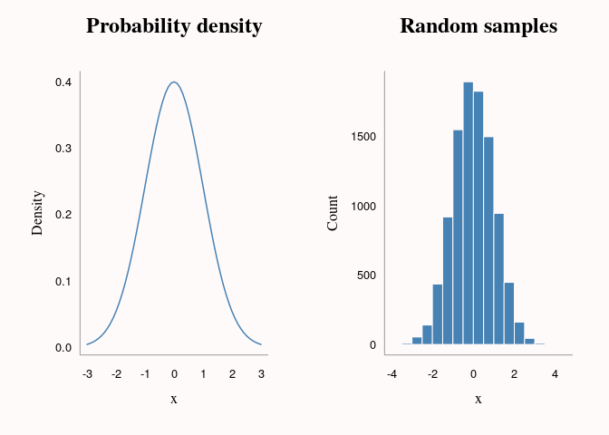
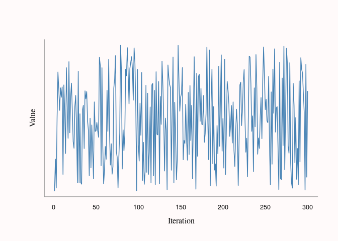

Handy Algorithms
================
Adam Bartonicek
(last updated: 2021-04-27)

-   [Euler’s method](#eulers-method)
-   [Determinant by row-operations](#determinant-by-row-operations)
-   [Inverse transform random
    sampling](#inverse-transform-random-sampling)
-   [Pseudo-random number generation (linear congruential
    generator)](#pseudo-random-number-generation-linear-congruential-generator)

## Euler’s method

Find an approximate numerical solution to an ordinary differential
equation. Useful for when we want to find an approximation to function
*y* but only know its derivative, *dy*, and it’s value *y*<sub>0</sub>
at some initial *x*<sub>0</sub>.

We start from the initial value, and then iteratively increment *x* by a
stepsize and *y* by the derivative (evaluated at previous *x*) times the
stepsize:

``` r
# Derivative of function y
dy <- function(y) y

# Inputs: derivative function, initial x, initial y, stepsize, length
euler <- function(dy = NULL, x0 = 0, y0 = 1, stepsize = 0.1, len = 100) {
  
  x <- numeric(len)
  y <- numeric(len)
  
  x[1] <- x0
  y[1] <- y0
  
  # Iterate: 1) increment x by stepsize
  #          2) increment y by stepsize times derivative
  for (i in 2:len) {
    x[i] <- x[i - 1] + stepsize
    y[i] <- y[i - 1] + stepsize * dy(y[i - 1])
  }

  # Return list of x's and y's
  list(x = x, y = y)
}

# Example
b <- euler(dy, stepsize = 0.05)
x <- seq(0, 5, length.out = 100)

# Plot code not shown (see .Rmd)
```


## Determinant by row-operations

Find the determinant of a square matrix using row-operations.
Alternative to finding the determinant via minors and co-factors. Based
on the following properties of determinants:

1.  Multiplying row *i* by *c* mutliplies the determinant by *c*
2.  Subtracting *c* times row *i* from row *j* does not affect the
    determinant

We start from the first row and then do row operations to get 1’s on the
diagonal and 0’s under the diagonal, keeping score of the factors by
which we multiply/divide the rows, and then multiply out the factors
together:

``` r
det_row <- function(mat) {
  
  nr <- nrow(mat)
  fact <- numeric(nr - 1)
  
  for (i in seq_len(nr - 1)) {
    
    # Normalize current row (1 in first column) & save the multiplication factor
    fact[i] <- mat[i, i]
    mat[i, ] <- mat[i, ] / mat[i, i]
    
    # Subtract multiples of the current row from all succeeding rows
    # to get a column of zeros below
    for (j in (i + 1):nr)
    
      mat[j, ] <- mat[j, ] - mat[j, i] * mat[i, ] 
  
  }
  
  # Take the product of the multiplication factors 
  # & the last value in the matrix (unnormalized)
  prod(fact) * mat[nr, nr]

}

# Example

set.seed(12345)
mat <- matrix(sample(1:9), ncol = 3)

det_row(mat)
```

    ## [1] -95

``` r
det(mat)
```

    ## [1] -95

## Inverse transform random sampling

Generate random samples for an arbitrary distribution by using inverse
cumulative density function (or numerical approximation of it). This is
useful when we have a probability density function (PDF) but no function
to draw samples from it (e.g. like `rnorm()`, `rpois()`, etc…). If we
have cumulative density function (CDF), we can use it directly,
otherwise we can also make a CDF via R’s numerical integration.

(from Ben Lambert’s [Student Guide to Bayesian Statistics problem
sets](https://study.sagepub.com/lambert))

We take a CDF, approximate the inverse CDF (ICDF) via R’s `approxfun()`,
and then use this to back-transform \`runif()\`\` samples (cumulative
probabilities) into samples from the PDF:

``` r
# Probability density function (normal)
pdf <- function(x) (1 / sqrt(2 * pi)) * exp(-1/2 * (x)^2)

# ...suppose we didn't have rnorm() but had the pdf() above

# Use R's numerical integration to make a CDF
cdf <- function(x) {
  integrate(pdf, 0, x)[[1]]
}

# Make inverse CDF by numeric approximation (linear)
cumdens <- sapply(seq(0.01, 5, 0.01), cdf)
icdf <- approxfun(cumdens, seq(0.01, 5, 0.01))

# Draw random samples & transform via ICDF (+ flip sign)
samples <- runif(10000, 0, 0.5)
x <- icdf(samples) * ifelse(runif(1000, 0, 2) > 1, 1, -1)

# Plot code not shown (see .Rmd)
```



## Pseudo-random number generation (linear congruential generator)

Generate “random” samples using the following function:

*s*<sub>*t*</sub> = (*a* ⋅ *s*<sub>*t* − 1</sub> + *b*) mod *M*

where *a*, *b*, and *M* are integers and *s*<sub>*t*</sub> is the
current sample.

(from Ben Lambert’s [Student Guide to Bayesian Statistics problem
sets](https://study.sagepub.com/lambert))

``` r
s0 <- 1
a <- 1597
b <- 51749
M <- 244944

nsamples <- 300

s <- numeric(nsamples)
s[1] <- s0

for (i in 2:nsamples) {
  s[i] = (a * s[i - 1] + b) %% M
}

# Plot code not shown (see .Rmd)
```

``` r
y_breaks <- seq(0, 2.5, by = 0.5) * 1e5

plot(1:nsamples, s, type = 'l',
     xlab = '', ylab = '', 
     col = col_highlight, lwd = 1.5,
     axes = FALSE)
axis(1, tick = FALSE, line = -0.5)
mtext('Iteration', 1, line = 2, family = 'serif')
mtext('Value', 2, line = 0.75, family = 'serif', las = 0)
box(col = col_fade)
```


